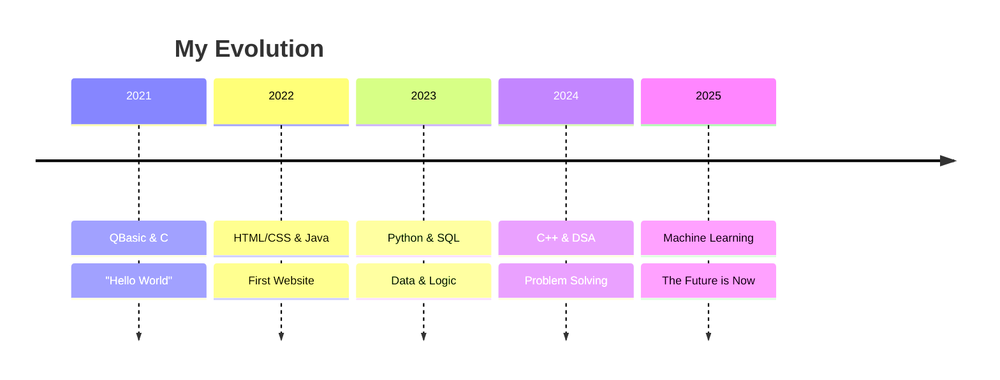

<div align="center">
  <h1>👋 Hello, I'm Abhishek Sharma</h1>
  <h3>Machine Learning Engineer | Data Science Enthusiast | Building Intelligent Systems</h3>
</div>

<div align="center">
  
</div>

<br>

```python
class Abhishek:
    def __init__(self):
        self.name = "Abhishek Sharma"
        self.pronouns = "He/Him"
        self.location = "India 🇮🇳"
        self.education = "B.Tech in Computer Science (2027)"
        
        self.current_focus = [
            "Machine Learning 🤖",
            "Deep Learning 🧠",
            "Data Science 📊",
            "Competitive Programming 💡"
        ]
        
        self.tech_stack = {
            "languages": ["Python", "Java", "C++", "SQL"],
            "ml_frameworks": ["TensorFlow", "PyTorch", "Scikit-learn"],
            "data_tools": ["Pandas", "NumPy", "Matplotlib", "Seaborn"],
            "web": ["React", "HTML/CSS", "JavaScript"]
        }
        
        self.current_learning = "Transformers & LLMs 🔥"
        self.fun_fact = "I code in MS Paint! 🎨"
    
    def say_hi(self):
        print("Thanks for dropping by! Let's build something amazing together!")

me = Abhishek()
me.say_hi()
```

<br>

<h2 align="center">🚀 My Coding Journey</h2>

<div align="center">



</div>

<br>

<h2 align="center">📚 Today's ML Paper</h2>

<div align="center">

<!--START_SECTION:arxiv-->
**Fetching latest Machine Learning paper from ArXiv...**

*This section auto-updates daily with trending ML research*
<!--END_SECTION:arxiv-->

</div>

<br>

<h2 align="center">🤖 Automated System Status</h2>

<div align="center">

| Agent | Status | Last Run |
|-------|--------|----------|
| 🧠 Profile Analyzer |  | Auto-updates daily + on push |
| 📚 Daily ArXiv Paper |  | Auto-updates at 00:00 UTC |
| 📊 WakaTime Stats |  | Auto-updates at 18:30 IST |
| 🐍 Contribution Snake |  | Auto-updates on push |

*All workflows running autonomously via GitHub Actions*

</div>

<br>

<h2 align="center">📊 Weekly Development Breakdown</h2>

<!--START_SECTION:waka-->
<!--END_SECTION:waka-->

<!--START_SECTION:unique-->
## 🧠 Currently Thinking About
> Exploring: Data, Update

## 🌟 Repo Spotlight (This Week)

| | |
|---|---|
| **[SIH_RAG](https://github.com/abhi-1408-shek/SIH_RAG)** | RAG prototype built during SIH’25 Finale |
| 🔤 HTML | ⭐ 4 stars |

## 🎭 My Commit Personality
| Trait | Value |
|-------|-------|
| ⏰ Coding Style | 🌅 Early Bird |
| 📅 Most Active | Tuesday |
| 💬 Favorite Word | `feat:` |

## 📅 My GitHub Journey
| When | Milestone |
|------|----------|
| 🚀 Jul 2024 | 🎉 Joined GitHub |
| 💻 Sep 2024 | 📁 First Repo: CIPHER-GUARD |
| ⚡ Feb 2026 | 🔥 Still Going Strong! |

*Auto-updated: 2026-02-04*
<!--END_SECTION:unique-->

<br>

<h2 align="center">🛠️ Tech Stack</h2>

<div align="center">
  
### 🤖 Machine Learning & Data Science


### 💻 Languages & Frameworks


### 🎨 Tools & Design


</div>

<br>

<h2 align="center">🔥 Featured Projects</h2>
<div align="center">
  <a href="https://abhi-gcet.netlify.app" target="_blank">
    
  </a>
  &nbsp;&nbsp;
  <a href="https://coder-verse.netlify.app" target="_blank">
    
  </a>
</div>

<br>

<div align="center">
  
</div>

<h2 align="center">📫 Connect With Me</h2>
<div align="center">
  <a href="https://x.com/mrabhishek1408" target="_blank">
    
  </a>
  <a href="https://www.linkedin.com/in/abhishek-sharma-gcet/" target="_blank">
    
  </a>
  <a href="https://www.hackerrank.com/abhishekpooja141" target="_blank">
    
  </a>
  <a href="https://www.leetcode.com/abhi_gcet" target="_blank">
    
  </a>
  <a href="https://www.kaggle.com/abhigcet" target="_blank">
    
  </a>
</div>

<br>
<div align="center">
   
</div>

<br>
<div align="center">
  <a href="https://www.buymeacoffee.com/abhigcet" target="_blank">
    
  </a>
</div>

<br>
<div align="center">
  
</div>

<div align="center">
  
</div>
