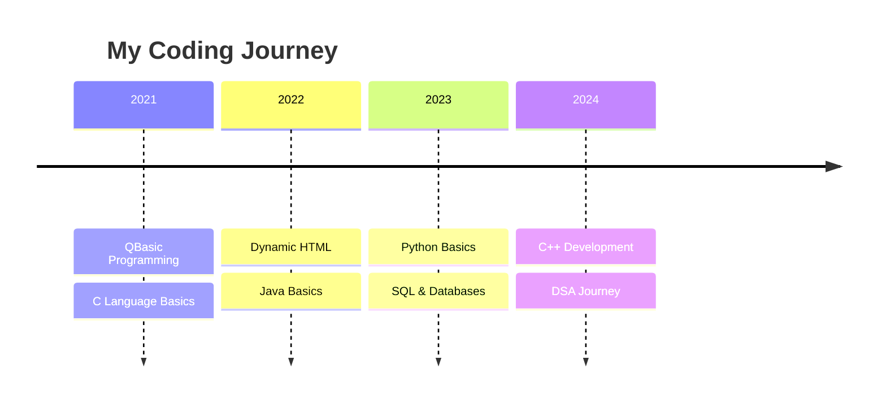

<div align="center">
  
</div>

<div align="center">
  
</div>

<h2 align="center">🚀 My Coding Journey</h2>

<div align="center">
  <br>



  <br>
  
  
  
  
  
  <br><br>
  
  
</div>

<div align="center">
  
  <b>Trying to enter the world of competitive coding</b>
</div>

<div align="center">
  <model-viewer
    src="https://raw.githubusercontent.com/abhi-1408-shek/abhi-1408-shek/main/assets/competitive-coding.glb"
    alt="3D visualization of competitive coding journey"
    auto-rotate
    camera-controls
    style="width: 400px; height: 400px;"
  ></model-viewer>
</div>

```javascript
const abhishek = {
    pronouns: "He" | "Him",
    location: "India, Earth 🌍",
    current_status: "Learning Java Multithreading 🧵",
    education: {
        degree: "Bachelor of Technology 🎓",
        major: "Computer Science 💻",
        graduation_year: 2027
    },
    interests: [
        "Full Stack Development 🚀",
        "Game Development 🎮",
        "Competitive Programming 💡",
        "MS Paint Art 🎨"
    ],
    current_learning: {
        language: "Java ☕",
        focus: "Multithreading",
        topics: [
            "Thread Lifecycle 🔄",
            "Synchronization 🔒",
            "Concurrency ⚡",
            "Thread Pools 🌊"
        ]
    },
    fun_fact: "I code in MS Paint! 🎨",
    favorite_quote: "while(!(succeed = try())); 💪",
    contact: {
        email: "abhishekpooja1408@gmail.com ✉️",
        project: "https://coder-verse.netlify.app 🌐",
        X (formally:Twitter): "@mrabhishek1408 🐦",
        leetcode: "abhi_gcet 💻"
    }
};
```

<h1 ALIGN = "CENTER"> <picture>
  <source srcset="https://fonts.gstatic.com/s/e/notoemoji/latest/26a1/512.webp" type="image/webp">
  
</picture> GITHUB STATS
<picture>
  <source srcset="https://fonts.gstatic.com/s/e/notoemoji/latest/26a1/512.webp" type="image/webp">
  
</picture></h1>
<div align="center">
  
  
<H4>THANK YOU PEOPLE FOR VISTING <picture>
  <source srcset="https://fonts.gstatic.com/s/e/notoemoji/latest/2728/512.webp" type="image/webp">
  
</picture>:</H4>
  <div align="center">
  
 
</div>
</div>

<br>

<h2 align="center">⚒️ Languages and Tools ⚒️</h2>

<table align="center">
  <tr>
    <td align="center" width="96">
      <a href="https://www.java.com" target="_blank" rel="noreferrer"> 
    </a>
    <br />JAVA
    </td>
    <td align="center" width="96">
      <a href="https://www.cprogramming.com/" target="_blank" rel="noreferrer"> 
           </a> 
      <br />C
    </td>
    <td align="center" width="96">
      
      <br>HTML5
    </td>
     <td align="center" width="96">
      
      <br>CSS
    </td>
    <td align="center" width="60">
    <a href="https://tailwindcss.com/" target="_blank" rel="noreferrer">
    </a>
      <br>TAILWIND
    </td>
    <td align="center" width="96">
       
      <br>JAVASCRIPT
    </td>
    <td align="center" width="60">
       
      <br>MySQL
    </td>
    <td align="center" width="60">
    
      <br>REACT
    </td>
    <td align="center" width="60">
     <a href="https://unrealengine.com/" target="_blank" rel="noreferrer">  </a> 
      <br />UNREAL
    </td>
    <td align="center" width="96">
    <a href="https://github.com/" target="_blank" rel="noreferrer">
    </a>
    <br>GITHUB
    </td>
  </tr>
  <tr>
     <td align="center" width="96">
      <a href="https://www.adobe.com/in/products/illustrator.html" target="_blank" rel="noreferrer">  </a> 
      <br />ILLUSTRATOR
    </td>
     <td align="center" width="96">
        <a href="https://www.blender.org/" target="_blank" rel="noreferrer"> 
            
        </a> 
      <br />BLENDER
    </td>
    <td align="center" width="96">
        
        <br/> VS CODE
    </td>
  </tr>
</table>

<br>

<!-- Projects -->
<h2 align="center">
  
  Featured Projects
  
</h2>

<div align="center">
  <a href="https://abhi-1408-shek.github.io/Portfolio/" target="_blank">
    
  </a>
  &nbsp;&nbsp;
  <a href="https://coder-verse.netlify.app" target="_blank">
    
  </a>
</div>

<h2 align="center">🌐 Let's Connect</h2>
<div align="center">
  <a href="https://x.com/mrabhishek1408" target="_blank">
    
  </a>
  <a href="https://www.linkedin.com/in/abhishek-sharma-gcet/" target="_blank">
    
  </a>
  <a href="https://www.hackerrank.com/abhishekpooja141" target="_blank">
    
  </a>
  <a href="https://www.leetcode.com/abhi_gcet" target="_blank">
    
  </a>
</div>
<br>

<div align="center">
  
</div>

<div align="center">
  <a href="https://www.buymeacoffee.com/abhigcet" target="_blank">
    
  </a>
</div>
<div align="center">
  
</div>
