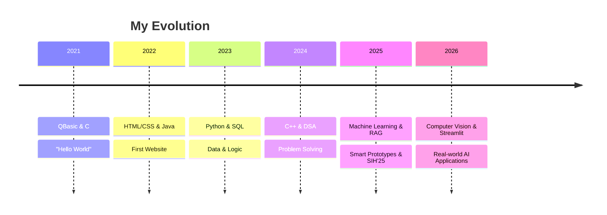

<div align="center">
  
</div>

<div align="center">
  <h3>Machine Learning Engineer | Data Science Enthusiast | Building Intelligent Systems</h3>
</div>

<br>

```python
class Abhishek:
    def __init__(self):
        self.name = "Abhishek Sharma"
        self.pronouns = "He/Him"
        self.location = "India 🇮🇳"
        self.education = "B.Tech in Computer Science (2027)"
        
        self.current_focus = [
            "Machine Learning 🤖",
            "Deep Learning 🧠",
            "Data Science 📊",
            "Competitive Programming 💡"
        ]
        
        self.tech_stack = {
            "languages": ["Python", "Java", "C++", "SQL"],
            "ml_frameworks": ["TensorFlow", "PyTorch", "Scikit-learn"],
            "data_tools": ["Pandas", "NumPy", "Matplotlib", "Seaborn"],
            "web": ["React", "HTML/CSS", "JavaScript"]
        }
        
        self.current_learning = "Transformers & LLMs 🔥"
        self.fun_fact = "I code in MS Paint! 🎨"
    
    def say_hi(self):
        print("Thanks for dropping by! Let's build something amazing together!")

me = Abhishek()
me.say_hi()
```

<br>

<h2 align="center">🚀 My Coding Journey</h2>

<div align="center">


```mermaid
timeline
    title My Evolution
    2021 : QBasic & C
         : "Hello World"
    2022 : HTML/CSS & Java
         : First Website
    2023 : Python & SQL
         : Data & Logic
    2024 : C++ & DSA
         : Problem Solving
    2025 : Machine Learning & RAG
         : Smart Prototypes & SIH'25
    2026 : Computer Vision & Streamlit
         : Real-world AI Applications
```

</div>

<br>

<h2 align="center">📚 Today's ML Paper</h2>

<div align="center">

<!--START_SECTION:arxiv-->
**📄 1-Lipschitz Neural Networks on Hadamard Manifolds**

👥 *Authors*: Davide Murari, Marta Ghirardelli, Ben Adcock et al.

📝 *Abstract*: Controlling the Lipschitz constant of a neural network is a standard way to promote robustness and stability. Most existing constraining strategies are designed for Euclidean spaces. In this work, we construct and analyze a class of 1-Lipschitz neural networks on Hadamard manifolds. Our layers ar...

🔗 [Read on ArXiv](https://arxiv.org/abs/2607.19335v1)

*Last updated: 2026-07-22 03:25 UTC*
<!--END_SECTION:arxiv-->

</div>

<br>


<h2 align="center">🤖 Automated System Status</h2>

<div align="center">

| Agent | Status | Last Run |
|-------|--------|----------|
| 🧠 Profile Analyzer |  | Auto-updates daily + on push |
| 📚 Daily ArXiv Paper |  | Auto-updates at 00:00 UTC |
| 📊 WakaTime Stats |  | Auto-updates at 18:30 IST |
| 🐍 Contribution Snake |  | Auto-updates on push |

*All workflows running autonomously via GitHub Actions*

</div>

<br>

<h2 align="center">📊 Weekly Development Breakdown</h2>

<!--START_SECTION:waka-->


**I'm a Night 🦉** 

```text
🌞 Morning                31 commits          █░░░░░░░░░░░░░░░░░░░░░░░░   04.78 % 
🌆 Daytime                90 commits          ███░░░░░░░░░░░░░░░░░░░░░░   13.87 % 
🌃 Evening                418 commits         ████████████████░░░░░░░░░   64.41 % 
🌙 Night                  110 commits         ████░░░░░░░░░░░░░░░░░░░░░   16.95 % 
```
📅 **I'm Most Productive on Monday** 

```text
Monday                   146 commits         ██████░░░░░░░░░░░░░░░░░░░   22.50 % 
Tuesday                  92 commits          ████░░░░░░░░░░░░░░░░░░░░░   14.18 % 
Wednesday                60 commits          ██░░░░░░░░░░░░░░░░░░░░░░░   09.24 % 
Thursday                 80 commits          ███░░░░░░░░░░░░░░░░░░░░░░   12.33 % 
Friday                   67 commits          ███░░░░░░░░░░░░░░░░░░░░░░   10.32 % 
Saturday                 66 commits          ███░░░░░░░░░░░░░░░░░░░░░░   10.17 % 
Sunday                   138 commits         █████░░░░░░░░░░░░░░░░░░░░   21.26 % 
```


📊 **This Week I Spent My Time On** 

```text
💬 Programming Languages: 
Python                   3 hrs 32 mins       ███████████░░░░░░░░░░░░░░   42.94 % 
Markdown                 1 hr 46 mins        █████░░░░░░░░░░░░░░░░░░░░   21.56 % 
Text                     1 hr 4 mins         ███░░░░░░░░░░░░░░░░░░░░░░   12.98 % 
Other                    37 mins             ██░░░░░░░░░░░░░░░░░░░░░░░   07.67 % 
JavaScript               33 mins             ██░░░░░░░░░░░░░░░░░░░░░░░   06.79 % 

🐱‍💻 Projects: 
internshala_project      4 hrs 58 mins       ███████████████░░░░░░░░░░   60.30 % 
new_project              1 hr 59 mins        ██████░░░░░░░░░░░░░░░░░░░   24.22 % 
video_gyaan              1 hr 5 mins         ███░░░░░░░░░░░░░░░░░░░░░░   13.30 % 
Unknown Project          4 mins              ░░░░░░░░░░░░░░░░░░░░░░░░░   00.87 % 
hdfc                     4 mins              ░░░░░░░░░░░░░░░░░░░░░░░░░   00.86 % 
```

**I Mostly Code in Python** 

```text
Python                   12 repos            █████████░░░░░░░░░░░░░░░░   37.50 % 
JavaScript               6 repos             █████░░░░░░░░░░░░░░░░░░░░   18.75 % 
HTML                     3 repos             ██░░░░░░░░░░░░░░░░░░░░░░░   09.38 % 
Jupyter Notebook         2 repos             ██░░░░░░░░░░░░░░░░░░░░░░░   06.25 % 
CSS                      2 repos             ██░░░░░░░░░░░░░░░░░░░░░░░   06.25 % 
```


 Last Updated on 22/07/2026 14:51:28 UTC
<!--END_SECTION:waka-->

<!--START_SECTION:unique-->
## 🧠 Currently Thinking About
> Exploring: Python

## 🌟 Repo Spotlight (This Week)

| | |
|---|---|
| **[EDGE_CORRECTOR_THERMAL](https://github.com/abhi-1408-shek/EDGE_CORRECTOR_THERMAL)** | pixelift group |
| 🔤 Jupyter Notebook | ⭐ 2 stars |

## 🎭 My Commit Personality
| Trait | Value |
|-------|-------|
| ⏰ Coding Style | 🌆 Evening Hacker |
| 📅 Most Active | Sunday |
| 💬 Favorite Word | `auto-update:` |

## 📅 My GitHub Journey
| When | Milestone |
|------|----------|
| 🚀 Jul 2024 | 🎉 Joined GitHub |
| 💻 Sep 2024 | 📁 First Repo: CIPHER-GUARD |
| ⚡ Jul 2026 | 🔥 Still Going Strong! |

*Auto-updated: 2026-07-22*
<!--END_SECTION:unique-->

<br>

<h2 align="center">🛠️ Tech Stack</h2>

<div align="center">

### 🤖 Machine Learning & Data Science

<br>


### 💻 Languages & Frameworks


### 🎨 Tools & Design


</div>

<br>


<br>

<div align="center">
  
</div>

<h2 align="center">📫 Connect With Me</h2>
<div align="center">
  <a href="https://abhi-shek-max.netlify.app" target="_blank">
    
  </a>
  &nbsp;&nbsp;
  <a href="https://x.com/mrabhishek1408" target="_blank">
    
  </a>
  <a href="https://www.linkedin.com/in/abhishek-sharma-gcet/" target="_blank">
    
  </a>
  <a href="https://www.hackerrank.com/abhishekpooja141" target="_blank">
    
  </a>
  <a href="https://www.leetcode.com/abhi_gcet" target="_blank">
    
  </a>
  <a href="https://www.kaggle.com/abhigcet" target="_blank">
    
  </a>
</div>

<br>
<div align="center">
   
</div>

<br>
<div align="center">
  <a href="https://www.buymeacoffee.com/abhigcet" target="_blank">
    
  </a>
</div>

<br>
<div align="center">
  
</div>

<div align="center">
  
</div>
