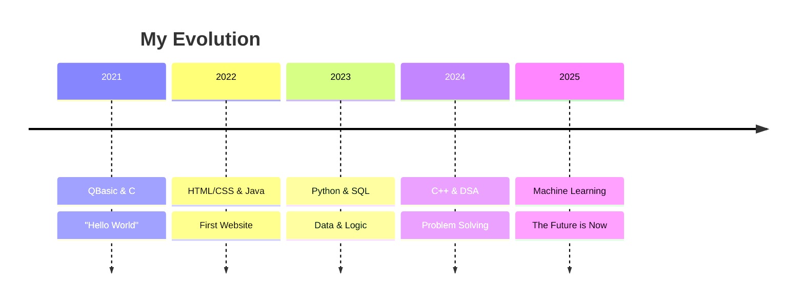

<div align="center">
  
</div>

<div align="center">
  <h3>Machine Learning Engineer | Data Science Enthusiast | Building Intelligent Systems</h3>
</div>

<br>

```python
class Abhishek:
    def __init__(self):
        self.name = "Abhishek Sharma"
        self.pronouns = "He/Him"
        self.location = "India 🇮🇳"
        self.education = "B.Tech in Computer Science (2027)"
        
        self.current_focus = [
            "Machine Learning 🤖",
            "Deep Learning 🧠",
            "Data Science 📊",
            "Competitive Programming 💡"
        ]
        
        self.tech_stack = {
            "languages": ["Python", "Java", "C++", "SQL"],
            "ml_frameworks": ["TensorFlow", "PyTorch", "Scikit-learn"],
            "data_tools": ["Pandas", "NumPy", "Matplotlib", "Seaborn"],
            "web": ["React", "HTML/CSS", "JavaScript"]
        }
        
        self.current_learning = "Transformers & LLMs 🔥"
        self.fun_fact = "I code in MS Paint! 🎨"
    
    def say_hi(self):
        print("Thanks for dropping by! Let's build something amazing together!")

me = Abhishek()
me.say_hi()
```

<br>

<h2 align="center">🚀 My Coding Journey</h2>

<div align="center">


```mermaid
timeline
    title My Evolution
    2021 : QBasic & C
         : "Hello World"
    2022 : HTML/CSS & Java
         : First Website
    2023 : Python & SQL
         : Data & Logic
    2024 : C++ & DSA
         : Problem Solving
    2025 : Machine Learning
         : The Future is Now
```

</div>

<br>

<h2 align="center">📚 Today's ML Paper</h2>

<div align="center">

<!--START_SECTION:arxiv-->
**📄 Computing Equilibrium beyond Unilateral Deviation**

👥 *Authors*: Mingyang Liu, Gabriele Farina, Asuman Ozdaglar

📝 *Abstract*: Most familiar equilibrium concepts, such as Nash and correlated equilibrium, guarantee only that no single player can improve their utility by deviating unilaterally. They offer no guarantees against profitable coordinated deviations by coalitions. Although the literature proposes solution concep...

🔗 [Read on ArXiv](https://arxiv.org/abs/2604.28186v1)

*Last updated: 2026-05-02 03:34 UTC*
<!--END_SECTION:arxiv-->

</div>

<br>

<h2 align="center">🤖 Automated System Status</h2>

<div align="center">

| Agent | Status | Last Run |
|-------|--------|----------|
| 🧠 Profile Analyzer |  | Auto-updates daily + on push |
| 📚 Daily ArXiv Paper |  | Auto-updates at 00:00 UTC |
| 📊 WakaTime Stats |  | Auto-updates at 18:30 IST |
| 🐍 Contribution Snake |  | Auto-updates on push |

*All workflows running autonomously via GitHub Actions*

</div>

<br>

<h2 align="center">📊 Weekly Development Breakdown</h2>

<!--START_SECTION:waka-->


**I'm a Night 🦉** 

```text
🌞 Morning                34 commits          ██░░░░░░░░░░░░░░░░░░░░░░░   06.31 % 
🌆 Daytime                87 commits          ████░░░░░░░░░░░░░░░░░░░░░   16.14 % 
🌃 Evening                332 commits         ███████████████░░░░░░░░░░   61.60 % 
🌙 Night                  86 commits          ████░░░░░░░░░░░░░░░░░░░░░   15.96 % 
```
📅 **I'm Most Productive on Monday** 

```text
Monday                   131 commits         ██████░░░░░░░░░░░░░░░░░░░   24.30 % 
Tuesday                  76 commits          ████░░░░░░░░░░░░░░░░░░░░░   14.10 % 
Wednesday                42 commits          ██░░░░░░░░░░░░░░░░░░░░░░░   07.79 % 
Thursday                 69 commits          ███░░░░░░░░░░░░░░░░░░░░░░   12.80 % 
Friday                   56 commits          ███░░░░░░░░░░░░░░░░░░░░░░   10.39 % 
Saturday                 54 commits          ███░░░░░░░░░░░░░░░░░░░░░░   10.02 % 
Sunday                   111 commits         █████░░░░░░░░░░░░░░░░░░░░   20.59 % 
```


📊 **This Week I Spent My Time On** 

```text
💬 Programming Languages: 
Other                    9 mins              █████████████░░░░░░░░░░░░   50.96 % 
C++                      8 mins              ████████████░░░░░░░░░░░░░   49.04 % 

🐱‍💻 Projects: 
computer_graphic         17 mins             █████████████████████████   100.00 % 
```

**I Mostly Code in Python** 

```text
JavaScript               5 repos             ████░░░░░░░░░░░░░░░░░░░░░   17.86 % 
TypeScript               4 repos             ████░░░░░░░░░░░░░░░░░░░░░   14.29 % 
HTML                     3 repos             ███░░░░░░░░░░░░░░░░░░░░░░   10.71 % 
Java                     3 repos             ███░░░░░░░░░░░░░░░░░░░░░░   10.71 % 
CSS                      2 repos             ██░░░░░░░░░░░░░░░░░░░░░░░   07.14 % 
```


 Last Updated on 02/05/2026 14:03:10 UTC
<!--END_SECTION:waka-->

<!--START_SECTION:unique-->
## 🧠 Currently Thinking About
> Exploring: Feature

## 🌟 Repo Spotlight (This Week)

| | |
|---|---|
| **[summer-of-code-2024](https://github.com/abhi-1408-shek/summer-of-code-2024)** | 5-week long hackathon spanning across 4 tracks |
| 🔤 Multiple | ⭐ 0 stars |

## 🎭 My Commit Personality
| Trait | Value |
|-------|-------|
| ⏰ Coding Style | ☀️ Day Coder |
| 📅 Most Active | Tuesday |
| 💬 Favorite Word | `auto-update:` |

## 📅 My GitHub Journey
| When | Milestone |
|------|----------|
| 🚀 Jul 2024 | 🎉 Joined GitHub |
| 💻 Sep 2024 | 📁 First Repo: CIPHER-GUARD |
| ⚡ May 2026 | 🔥 Still Going Strong! |

*Auto-updated: 2026-05-03*
<!--END_SECTION:unique-->

<br>

<h2 align="center">🛠️ Tech Stack</h2>

<div align="center">
  
### 🤖 Machine Learning & Data Science


### 💻 Languages & Frameworks


### 🎨 Tools & Design


</div>

<br>

<h2 align="center">🔥 Featured Projects</h2>
<div align="center">
  <a href="https://abhi-gcet.netlify.app" target="_blank">
    
  </a>
  &nbsp;&nbsp;
  <a href="https://coder-verse.netlify.app" target="_blank">
    
  </a>
</div>

<br>

<div align="center">
  
</div>

<h2 align="center">📫 Connect With Me</h2>
<div align="center">
  <a href="https://x.com/mrabhishek1408" target="_blank">
    
  </a>
  <a href="https://www.linkedin.com/in/abhishek-sharma-gcet/" target="_blank">
    
  </a>
  <a href="https://www.hackerrank.com/abhishekpooja141" target="_blank">
    
  </a>
  <a href="https://www.leetcode.com/abhi_gcet" target="_blank">
    
  </a>
  <a href="https://www.kaggle.com/abhigcet" target="_blank">
    
  </a>
</div>

<br>
<div align="center">
   
</div>

<br>
<div align="center">
  <a href="https://www.buymeacoffee.com/abhigcet" target="_blank">
    
  </a>
</div>

<br>
<div align="center">
  
</div>

<div align="center">
  
</div>
