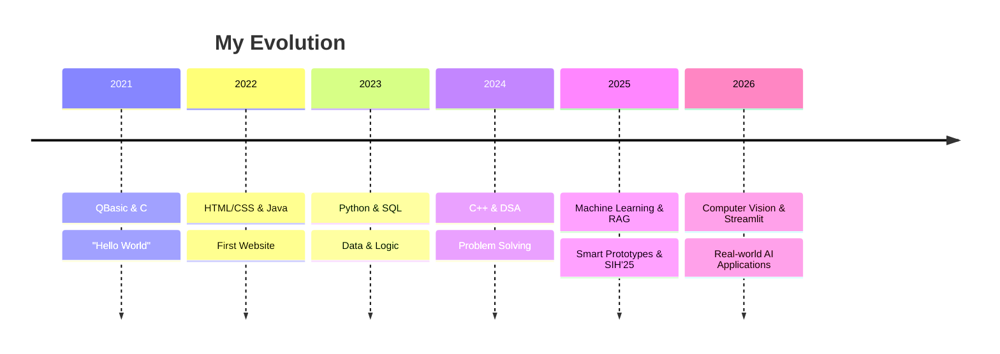

<div align="center">
  
</div>

<div align="center">
  <h3>Machine Learning Engineer | Data Science Enthusiast | Building Intelligent Systems</h3>
</div>

<br>

```python
class Abhishek:
    def __init__(self):
        self.name = "Abhishek Sharma"
        self.pronouns = "He/Him"
        self.location = "India 🇮🇳"
        self.education = "B.Tech in Computer Science (2027)"
        
        self.current_focus = [
            "Machine Learning 🤖",
            "Deep Learning 🧠",
            "Data Science 📊",
            "Competitive Programming 💡"
        ]
        
        self.tech_stack = {
            "languages": ["Python", "Java", "C++", "SQL"],
            "ml_frameworks": ["TensorFlow", "PyTorch", "Scikit-learn"],
            "data_tools": ["Pandas", "NumPy", "Matplotlib", "Seaborn"],
            "web": ["React", "HTML/CSS", "JavaScript"]
        }
        
        self.current_learning = "Transformers & LLMs 🔥"
        self.fun_fact = "I code in MS Paint! 🎨"
    
    def say_hi(self):
        print("Thanks for dropping by! Let's build something amazing together!")

me = Abhishek()
me.say_hi()
```

<br>

<h2 align="center">🚀 My Coding Journey</h2>

<div align="center">


```mermaid
timeline
    title My Evolution
    2021 : QBasic & C
         : "Hello World"
    2022 : HTML/CSS & Java
         : First Website
    2023 : Python & SQL
         : Data & Logic
    2024 : C++ & DSA
         : Problem Solving
    2025 : Machine Learning & RAG
         : Smart Prototypes & SIH'25
    2026 : Computer Vision & Streamlit
         : Real-world AI Applications
```

</div>

<br>

<h2 align="center">📚 Today's ML Paper</h2>

<div align="center">

<!--START_SECTION:arxiv-->
**📄 ENCP: Episode-Normalized Conformal Prediction for Vision-and-Language Navigation**

👥 *Authors*: Vicky Feliren, A. Taufiq Asyhari, Muhamad Risqi U. Saputra

📝 *Abstract*: Uncertainty estimation for Vision-Language-Navigation (VLN) models is a critical task since it can help identify ambiguous and unreliable predictions, enabling agents to make safer navigation decisions. As one of the most advanced uncertainty estimation frameworks, conformal prediction (CP) offer...

🔗 [Read on ArXiv](https://arxiv.org/abs/2609.17499v1)

*Last updated: 2026-09-16 04:28 UTC*
<!--END_SECTION:arxiv-->

</div>

<br>


<h2 align="center">🤖 Automated System Status</h2>

<div align="center">

| Agent | Status | Last Run |
|-------|--------|----------|
| 🧠 Profile Analyzer |  | Auto-updates daily + on push |
| 📚 Daily ArXiv Paper |  | Auto-updates at 00:00 UTC |
| 📊 WakaTime Stats |  | Auto-updates at 18:30 IST |
| 🐍 Contribution Snake |  | Auto-updates on push |

*All workflows running autonomously via GitHub Actions*

</div>

<br>

<h2 align="center">📊 Weekly Development Breakdown</h2>

<!--START_SECTION:waka-->


**I'm a Night 🦉** 

```text
🌞 Morning                31 commits          █░░░░░░░░░░░░░░░░░░░░░░░░   04.71 % 
🌆 Daytime                92 commits          ███░░░░░░░░░░░░░░░░░░░░░░   13.98 % 
🌃 Evening                422 commits         ████████████████░░░░░░░░░   64.13 % 
🌙 Night                  113 commits         ████░░░░░░░░░░░░░░░░░░░░░   17.17 % 
```
📅 **I'm Most Productive on Monday** 

```text
Monday                   146 commits         ██████░░░░░░░░░░░░░░░░░░░   22.19 % 
Tuesday                  92 commits          ███░░░░░░░░░░░░░░░░░░░░░░   13.98 % 
Wednesday                64 commits          ██░░░░░░░░░░░░░░░░░░░░░░░   09.73 % 
Thursday                 82 commits          ███░░░░░░░░░░░░░░░░░░░░░░   12.46 % 
Friday                   67 commits          ███░░░░░░░░░░░░░░░░░░░░░░   10.18 % 
Saturday                 69 commits          ███░░░░░░░░░░░░░░░░░░░░░░   10.49 % 
Sunday                   138 commits         █████░░░░░░░░░░░░░░░░░░░░   20.97 % 
```


📊 **This Week I Spent My Time On** 

```text
💬 Programming Languages: 
Python                   1 hr 51 mins        █████████████░░░░░░░░░░░░   50.39 % 
Other                    44 mins             █████░░░░░░░░░░░░░░░░░░░░   19.81 % 
Text                     26 mins             ███░░░░░░░░░░░░░░░░░░░░░░   11.84 % 
Markdown                 22 mins             ███░░░░░░░░░░░░░░░░░░░░░░   10.18 % 
JavaScript               7 mins              █░░░░░░░░░░░░░░░░░░░░░░░░   03.36 % 

🐱‍💻 Projects: 
vikash                   2 hrs 46 mins       ███████████████████░░░░░░   74.82 % 
btorch                   22 mins             ██░░░░░░░░░░░░░░░░░░░░░░░   09.97 % 
digital-twin             19 mins             ██░░░░░░░░░░░░░░░░░░░░░░░   08.80 % 
foreign                  7 mins              █░░░░░░░░░░░░░░░░░░░░░░░░   03.59 % 
hf-space                 6 mins              █░░░░░░░░░░░░░░░░░░░░░░░░   02.83 % 
```

**I Mostly Code in Python** 

```text
Python                   13 repos            █████████░░░░░░░░░░░░░░░░   37.14 % 
JavaScript               6 repos             ████░░░░░░░░░░░░░░░░░░░░░   17.14 % 
TypeScript               5 repos             ████░░░░░░░░░░░░░░░░░░░░░   14.29 % 
Jupyter Notebook         2 repos             █░░░░░░░░░░░░░░░░░░░░░░░░   05.71 % 
Kotlin                   1 repo              █░░░░░░░░░░░░░░░░░░░░░░░░   02.86 % 
```


 Last Updated on 20/09/2026 16:33:22 UTC
<!--END_SECTION:waka-->

<!--START_SECTION:unique-->
## 🧠 Currently Thinking About
> Exploring: Optimize

## 🌟 Repo Spotlight (This Week)

| | |
|---|---|
| **[EDGE_CORRECTOR_THERMAL](https://github.com/abhi-1408-shek/EDGE_CORRECTOR_THERMAL)** | pixelift group |
| 🔤 Jupyter Notebook | ⭐ 3 stars |

## 🎭 My Commit Personality
| Trait | Value |
|-------|-------|
| ⏰ Coding Style | ☀️ Day Coder |
| 📅 Most Active | Wednesday |
| 💬 Favorite Word | `generated` |

## 📅 My GitHub Journey
| When | Milestone |
|------|----------|
| 🚀 Jul 2024 | 🎉 Joined GitHub |
| 💻 Sep 2024 | 📁 First Repo: CIPHER-GUARD |
| ⚡ Sep 2026 | 🔥 Still Going Strong! |

*Auto-updated: 2026-09-20*
<!--END_SECTION:unique-->

<br>

<h2 align="center">🛠️ Tech Stack</h2>

<div align="center">

### 🤖 Machine Learning & Data Science

<br>


### 💻 Languages & Frameworks


### 🎨 Tools & Design


</div>

<br>


<br>

<div align="center">
  
</div>

<h2 align="center">📫 Connect With Me</h2>
<div align="center">
  <a href="https://abhi-shek-max.netlify.app" target="_blank">
    
  </a>
  &nbsp;&nbsp;
  <a href="https://x.com/mrabhishek1408" target="_blank">
    
  </a>
  <a href="https://www.linkedin.com/in/abhishek-sharma-gcet/" target="_blank">
    
  </a>
  <a href="https://www.hackerrank.com/abhishekpooja141" target="_blank">
    
  </a>
  <a href="https://www.leetcode.com/abhi_gcet" target="_blank">
    
  </a>
  <a href="https://www.kaggle.com/abhigcet" target="_blank">
    
  </a>
</div>

<br>
<div align="center">
   
</div>

<br>
<div align="center">
  <a href="https://www.buymeacoffee.com/abhigcet" target="_blank">
    
  </a>
</div>

<br>
<div align="center">
  
</div>

<div align="center">
  
</div>
